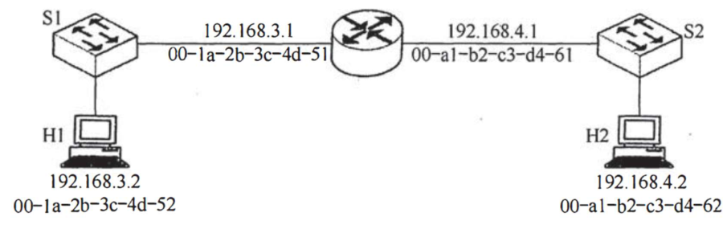

# 408 2016–2025 新卷核对

## 范围

接入用户本次提供的 `/Users/apple/Downloads/408-exam-paper/papers-rebuild/2016.pdf` 至 `2025.pdf`，十份共 114 页，只含试题。保留原有 2009–2015 题目/解析。仍以 [考研真题大全](../exam-library/index.htm) 为汇总入口；历史目录名 `cs408-latex-2009-2017` 保留以兼容已保存的链接。

每年转录按原页覆盖，检查第 1–47 题；公式、矩阵、代码、表格为可编辑内容。仅独立示意图保留原图。原稿疑点在 JSON notes 与网页说明中保留，未据答案擅自改题。此次没有导入用户未提供的相邻答案文件。

## 独立审核与修复

独立审核对照构建器、验证器、源清单和备份，检查旧内容保护及新资料边界，并抽查非本人转录的 2016/2022。

- 审核指出 2020 第 21 题、2023 第 22 题只有 A 选项位于前一原页，旧分组选项逻辑漏排这个 A。已允许有明确题号的单 A 段落进入选项布局，并在验证器加入回归检查。
- 所有拆组选项按去空白及统一标签句点后重组，与输入逐字比较，避免格式化时丢题干或选项。
- 2018 第 37 题原裁图混入正文及选项，并截断两侧 MAC 地址；图框改为 `[98,495,503,621]`，重新裁图目视核对。
- 编译检查发现 2021 指令编码表格字段溢出；仅新卷表格中的方向箭头添加可换行点，原有文档保持字节一致。
- 原稿中的短填空线恢复为可编辑下划线。特殊上下标和 μ 单位改为 TeX，避免字体缺字。

## 最终验证

17 份文档、231 个原页已完成全量构建；17 份 TeX 全部编译通过且无缺字/溢出警告，429 个去重公式渲染无错。新增十年每年题号 1–47 各一次；403 组选项按源内容无损重组。原版 231 个 SVG 均与原 PDF 的原生渲染逐字节一致。

总目录 7 类、289 张卡片、578 个版本入口、1801 个本地链接均通过结构验证；修改前 558 个版本文档内容散列、路径和相对顺序全部保留。构建后 manifest 的编译标记为 true，记录对应当前 TeX 散列。

## 渲染证据

以下是 XeLaTeX 编译 PDF 的原生渲染截图，用来检查转录、公式与 TeX 输出；不是网页截图。HTM 的浏览器交互、复制按钮和窄屏布局未复验。

## 备份与恢复

`../exam-library/work/before-cs408-2016-2025` 保存修改前构建器、清单、入口及旧 558 个版本文档路径和 SHA-256。回退时恢复备份的清单/构建器/入口并重建，新增转录数据可保留，原 PDF 不删除、不改写。本次仅本地交付，没有推送或发布。

完整数据校验见 [verification.json](verification.json)、[TeX 编译记录](assets/verification/latex-compilation.json)、[旧文档保持记录](../exam-library/work/cs408-2016-2025-preservation.json)。编译和覆盖检查不等同于对原稿答案正确性的保证。

## 2023 第 5 题勘误

change / bug / R1 / local-trial：按用户新提供的截图，仅将选项 C 从 `c, e, b, e, f, d` 改为 `c, a, b, e, f, d`。A/B/D 与截图一致，原 PDF 与 SVG 原版保持不变。原稿疑点说明同步改为已按用户截图修正。

JSON、HTM 和 TeX 中 A–D 四项均逐项核对；2023 TeX 重新编译通过，无缺字或溢出警告。其他 16 份文档的 HTM、TeX 散列未变，复用仍有效的编译证据。备份在 `work/before-2023-q5-correction`；验证结果见 [勘误检查](assets/verification/2023-q5-correction.json)。

