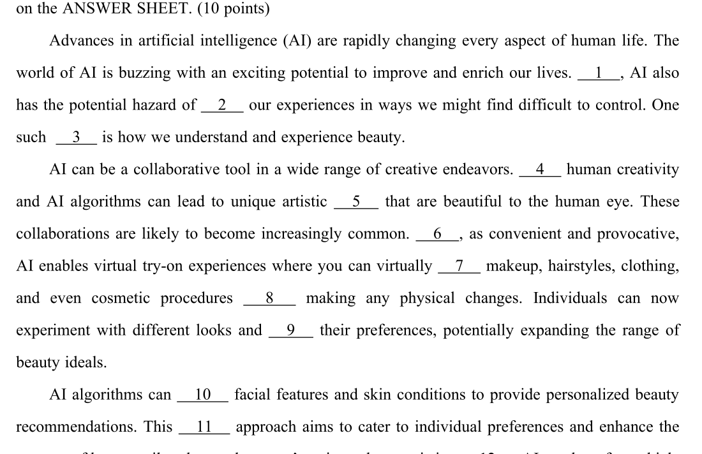
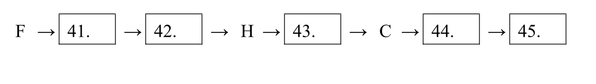
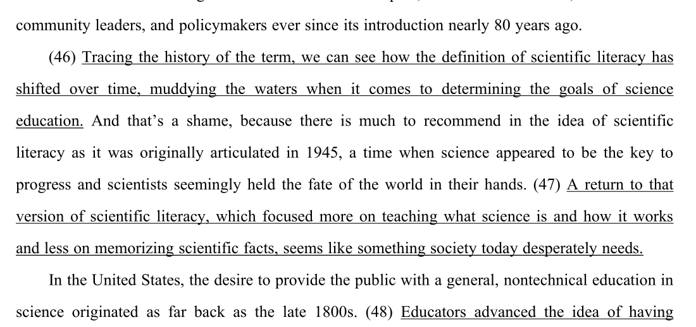
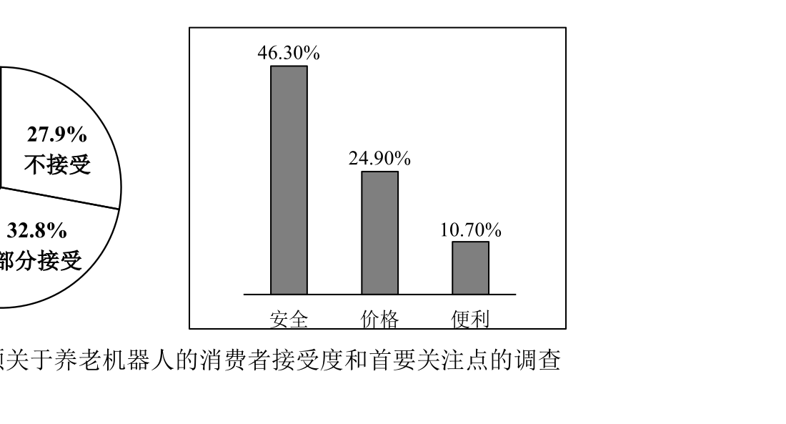

# 离线真题排版修复

模式：change；交付：local-trial；类型：bug；风险：R2（批量替换可恢复的本地衍生资料）。范围是 206 套 / 2020 页及独立考研 44 套副本。源文档、试卷内容、Anki 数据库与正式发布均不变。

## 原因与修复

此前把 PDF 文本重绘为本机字体，却保留原坐标的线条、图框，造成字距、下划线、题号和图表标签错位。现在保留完整 SVG 原字形轮廓，文字与图形使用同一个坐标系；页面按窗口等比缩放。每页 SVG 存放在对应 .assets 素材文件夹，按页加载，避免单个 HTML 嵌入几十 MB 数据。

每页保留透明文字选择层、默认可访问的文字和可展开复制的原文。整句查找请先展开文字。源字符编码异常页明确标注；不猜测替换原文。网站叠加的圆形答题按钮不属于源试卷，本归档保留原卷填空题号和横线。

## 填空题号与字距

## 流程图框

## 翻译下划线

## 图表标签

以上图片来自实际交付 SVG 的本地渲染，不是浏览器截图。

## 验证与限制

206 套、2020 页；逐页来源哈希、SVG 字节和资源引用、文字转换、本地链接、独立考研副本完整性校验通过。抽查 14 页，用 librsvg 独立渲染与原 PDF 栅格结果比对；覆盖所有截图问题类型及四类新增试卷。CET4 2020-12-01 第 5 页的栅格误差较高，单独并排检查，文字/行距/断行一致，差异为像素边缘表现。两个下载器另分别用 14 页考研样本与 1 页共享题面样本离线验证。

本轮没有完成浏览器交互、选择高亮和移动端性能实测。浏览器 file URL 被工具策略拦截后未绕过；以本地 SVG 渲染和文件结构校验作为明确限定的证据。不能将这些结果称为全部设备显示测试通过。

## 备份与恢复

替换前快照在 ../layout-repair-backup/，backup-manifest.json 记录原文件与压缩包校验和；源 PDF 缓存未修改。替换前再次比较现有文件与备份，防止覆盖期间的新改动。需要恢复时把对应档案子目录的备份文件和旧 ZIP 复制回原路径；新增 .assets 文件留在原处不会影响旧 HTML。安装记录为 ../layout-repair-install.json。
