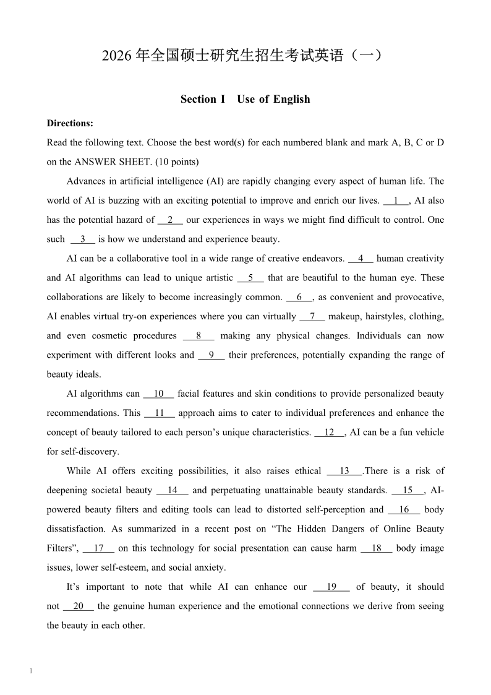

# 真题封面目录与网址标识清理

本次为本地显示修改（bug / R2）：用户要求去掉可见网址，并恢复按年份浏览试卷封面的展示。原始文档和来源清单保留，未改 Anki 或远端发布。

## 目录展示

首页按五类考试展示封面；分类页按年份分组展示每套试卷的真实首页缩略图，附标题和页数。桌面双列、窄屏单列，可按年份跳转；点击整张卡片打开全文。使用本地 SVG 素材，不依赖网络或远程图片。

## 网址标识

目录没有原网页/来源列，试卷阅读页没有可见来源网址。对 1,145 页包含的网址，按字符范围在内存副本中删除 URL 字形，再生成对应 SVG 与复制文字；不遮盖页脚、不改源文件。其余正文、页码、线条和图片保持原有排版。

以下是实际交付封面的 SVG 本地渲染，页脚网址已去除，页码保留；不是目录浏览器截图。

## 校验

每个修改页用原文去除 URL 后与生成文本逐字比较（仅归一化空白），同时校验源文件哈希、素材、本地链接、目录封面数量及双份考研档案。2026 英语一首页像素比较只有网址矩形内 892 个像素变化，范围外零变化。浏览器交互未完成实测；目录 CSS、真实封面资源与链接已静态核验。详细结果见 verification.json。

## 恢复

本轮完整备份在 ../visual-catalog-run/backup/；校验清单在 ../visual-catalog-run/backup-manifest.json；安装记录在 ../visual-catalog-install.json。ZIP 与页面更新前再核对未出现并发修改，失败恢复已安装部分。
