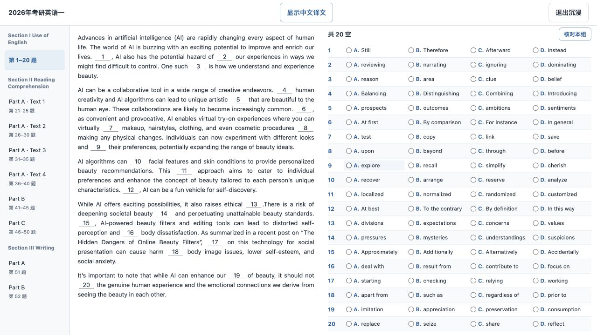
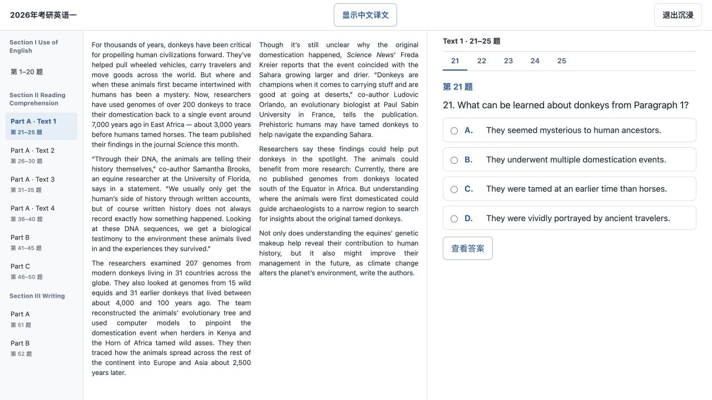
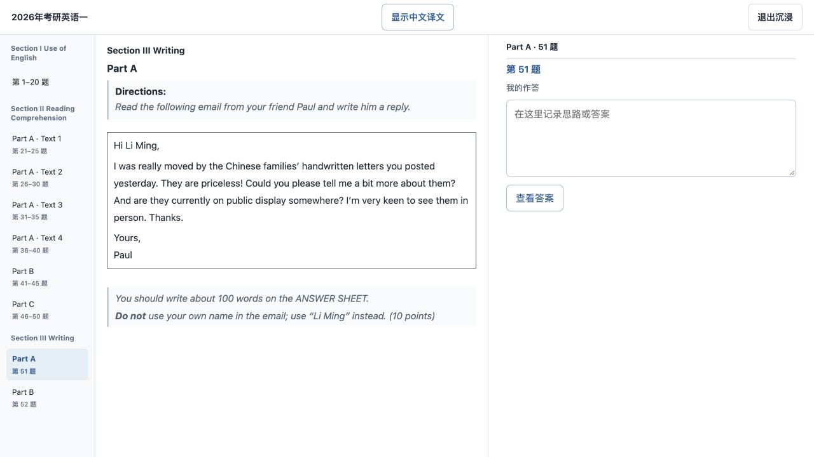

# v0.1.0 发布记录

本次交付是 `feature`，风险为 `R2`：结构化题目、答案对应及页面呈现会影响练习判分和阅读，但源文件及本地数据库均可恢复。发布目标是 GitHub `main`、不可移动的 `v0.1.0` 标签与 Release。先前基线提交为 `bf6420c`；回退时先停本地服务，切回该提交，并按[数据库说明](QUESTION_DATABASE.md)恢复升级前的 SQLite 备份或从对应结构化源重建。

以下图片直接截取自本机 `localhost:8765` 上运行的 2026 年考研英语一整卷练习，展示实际浏览器内容；它们证明这些具体视图的外观，不代表 335 份资料均已逐页完成实机验收。

发布前检查包括完整 Node UI 测试、Python 结构与 API 测试、英语重排测试、英语答案证据校验、206 份英文译文 sidecar 的私有快照预检及公开数据一致性校验、结构化试卷和资源链接验证。也已从随版本提交的结构化数据独立重建临时 SQLite。阅读题已在真实页面完成一次选择并核对答案。无法从来源确认的答案仍保持未知。

GitHub 的干净检出只运行不依赖未提交原始 PDF 与私人答案证据的公开数据及可移植测试；涉及印刷页面、图片裁切和私有证据的完整源数据测试在本机具备这些输入时严格运行。两类结果分别记录，不能将 CI 通过解释为对所有原始 PDF 的复验。

源码归档包含已经核对并发布的结构化 JSON/JSONL 和公开译文，足以重建本地 SQLite 并运行阅读器；它**不包含**全部原始 PDF、私人答案捕获及翻译出版快照。完整上游来源再生成需要这些独立输入，例如 9 组单词填空的 90 道已核实答案来自本机证据文件。相关构建器在输入缺失时拒绝继续，不能把源码归档解释为全部 335 卷可独立再生成的工程。公开译文可在干净克隆中验证，严格的私人快照出版预检只作为本机发布证据。
