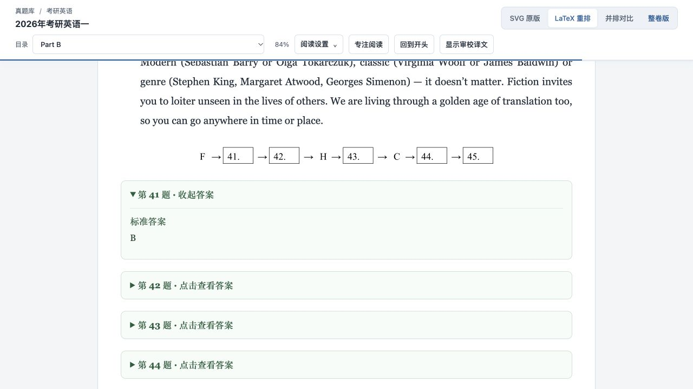
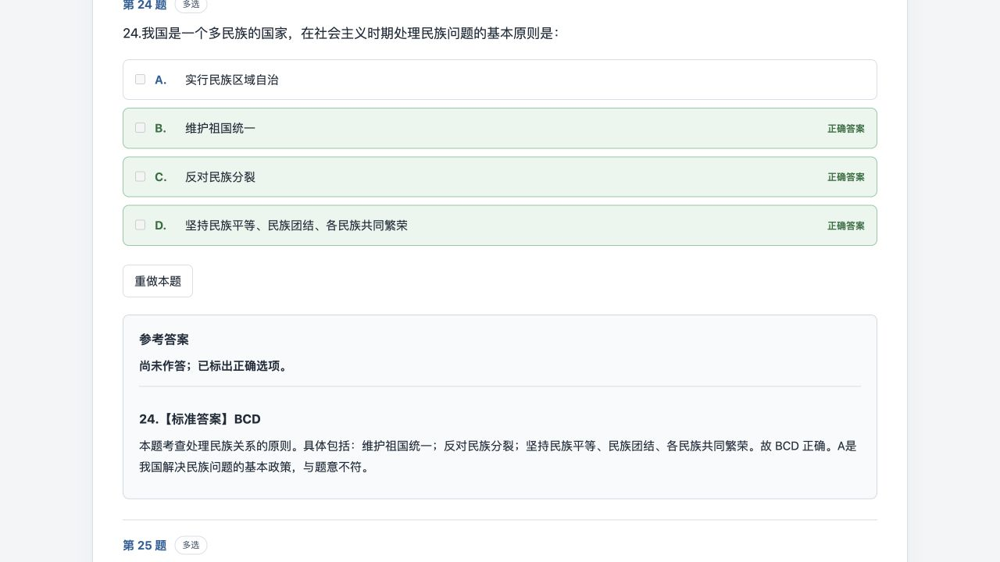

# 考研原 PDF、重排版与整卷版内容核查（2026-10-08）

本轮只核查考研英语、数学三、计算机 408 和政治；不核查 CET4、CET6、专四或专八。确认的转录和展示错误已修复，并同步到本机重排页、嵌入答案、整卷题库及 SQLite 数据库。原始 PDF 未改动。

这是一轮全库自动比对、候选差异逐项查看原图、重点页面实际浏览器验收相结合的核查。**不是对全部 1,414 个页段人工逐字、逐个公式符号的全覆盖认证；也不是重新解题验证每份参考答案的数学或学科正确性。**

## 范围和计数口径

“文档”包括题卷和独立答案卷。下表“页段”统计重排页实际生成的分段，共 1,414 个；原 PDF 的文档页绑定共 1,415 个，逐项清单采用原 PDF 页绑定口径。2019 政治答案卷对应 7 个原 PDF 页，重排为 6 个页段。一本合订 PDF 可对应多个题卷/答案卷，因此这些计数均不等于去重后的 PDF 物理页数。“题目”只计 `recordType=question` 的题卷问题，不计答案卷条目和公共材料。

| 类别 | 文档（含答案卷） | 重排页段 | 题卷题目 |
| --- | ---: | ---: | ---: |
| 考研英语 | 44 | 609 | 2175 |
| 考研数学三 | 66 | 181 | 927 |
| 计算机 408 | 27 | 333 | 799 |
| 考研政治 | 36 | 291 | 794 |
| 合计 | 173 | 1,414 | 4,695 |

覆盖 109 份去重后的原始 PDF。整卷可练习的题卷共 115 份；另外的答案卷保留在原版及重排阅读入口，不把答案卷当成独立刷题试卷。旧数学合订卷同时收录试卷 IV/V 及大题内重置编号，按原稿保留，不因题号重复就删题。

## 已修复的问题

| 问题 | 修复和证据 |
| --- | --- |
| 英语 Part B 多题共享同一材料时，答案卡反向排列 | 修正连续插入同一锚点的顺序，保留稳定题目 ID，答案标题明确标出题号。2026 英语一 41–45 题按 41、42、43、44、45 显示，对应 B、E、A、G、D。 |
| 浏览器缓存仍显示旧答案脚本 | 原版、重排页的共享答案脚本加内容版本标识；重建后实际页面加载新的脚本。 |
| 整卷版看不到原稿缺题或印刷勘误说明 | 增加“原卷说明（含原稿缺项与勘误）”，从同一份源备注生成；题卷可看到关联答案卷备注。当前 39 个文档有说明，不把缺失答案编造为已核验答案。 |
| 数学三整卷丢失或错放试卷 IV/V 标题，编者注出现编译副本 | 按原稿源块位置把试卷标题放回对应首题之前；去掉同文编译副本和解析器内部标题，题卡 ID、答案及顺序保留。1987 年实际浏览器验收及 1987–1992 年来源位置复核通过。 |
| 2010 政治第 24 题解析混入页眉广告，错误跨到第 4 页 | 将原 PDF 第 4 页页眉广告排除，保留排除记录；答案 BCD 不变，来源回到第 3 页。同步重排页、题卷答案、数据库和整卷页面。 |
| 五年政治解析出现 OCR 误字、漏字及标点错误 | 对 2015、2017、2018、2022、2023 年原 PDF 栅格图逐项确认后修正 109 次文字差异，其中 75 次补回漏掉的“的”。共 106 条校勘记录，部分记录在同一块中出现两次。 |

代表修正包括“促进人的全面发展”“竞相租借”“乡村建设”“公序良俗”“基本方法论”“基本观点”“政治局”“柬埔寨”“证券”“的灿烂文明”等。只在原图支持时改字，不根据语感批量改写原稿。

5 年文字修正共涉及 54 个源文本块，已重新生成对应解析及关联题卷。跨页续文保留在原段落的起始页；校勘记录同时记录源块起始页 `source_page` 和字形实际所在页 `pdf_page`，两者不同不表示跳页错配。

详见 [全部 OCR 校勘明细](content-audit-corrections-20261008.md) 和 [机器可读校勘记录](assets/content-audit-20261008/verified-ocr-corrections.json)。原 PDF 裁图证据保存在本机 `.local/kaoyan-content-audit-20261008/word-proof/` 和 `ocr-proof/`；其标号可与记录中的 `evidence` 对照。

## 原稿遗留问题与核查限制

| 项目 | 核查结论与页面处理 |
| --- | --- |
| 政治 2010 第 21 题 | 当前原题 PDF 自身缺这题。未补造题目；整卷说明明确标出缺项。 |
| 政治 2003–2008 年答案 | 当前本地资料没有可独立对应的答案卷；共 225 道题无已核验答案内容。保留题目和缺失状态，未把自行推断答案当原稿答案。 |
| 政治 2005 第 3 题 | 原 PDF 选项印为 A、B、C、C；保留原标记并说明需要按第四项位置区分。 |
| 408 2015 第 1 题 | 原 PDF 选项印为 A、B、B、D，另有代码大小写原稿问题；保留原稿并显示说明。 |
| 408 2022 第 6 题 | 原解析对 V/E 的顶点/边解释有误；补充勘误说明“V 为顶点集、E 为边集，生成树有 \|V\|−1 条边”，选项答案 D 保留。 |
| 408 2014 第 1 题解析 | 现有重排解析是语义整理，复杂度结论与原稿一致，但并非逐字转录；原 PDF 仍可对照阅读。不能把这部分描述成逐字一致。 |
| 政治 2007 第 38 题 | 原稿 I 部分已混有作答/评分内容，II 部分含两个问题；以原稿内容判断，未按题号扫描误判删掉材料。 |
| 数学三旧卷原稿勘误 | 原先已有的公式或文字勘误继续保留，并加入整卷说明，例如 1996 年试卷 V 第十题条件不相容、原参考答案仍按原稿列出。 |
| 英语答案核验口径 | 1,945 个客观题答案与本地保存的 BurningVocabulary 答案资料一致；题 PDF 本身通常不带答案，这不能替代官方原卷答案认证。 |
| 英语翻译与写作 | 230 道问题无独立已提供参考答案内容，是翻译/写作类缺项，不据此补造标准答案。译文语义逐句复审不在本轮自动英文源文本比对的认证范围内。 |
| 扫描图、公式和 OCR | 132 个缺可提取文本的页段另做栅格 OCR；候选误字查看原 PDF 裁图。公式资产存在、可渲染与原稿视觉抽查通过，不等于每个上下标都经过人工全覆盖校对。 |

## 核查证据与验证结果

- 原始 PDF：109 份 SHA-256 与修复前一致。原版 reader 的 173 份题文主体与备份一致，只更新共用 UI 元数据。
- 排除范围：324 个 CET/TEM 原版与重排 reader 的文件哈希不变。通用回归测试仍可能读取这些既有测试样本，不代表对其题文作了本轮校勘。
- 重排覆盖：173 文档、1,414 页段，231 个图块、7,333 个公式节点、2,280 个本地资源引用，未发现缺失资源。
- 英文比对：44 文档、609 页，177,026 个原版 SVG 文本 span；11,875 个较长英文片段中 11,813 个达到 90% 以上的词序片段覆盖阈值。低覆盖项是候选而非自动认定错漏；结合原图排查后再判断。短词、短选项、图内文字和译文不由此覆盖。
- 答案同步：4,240 个嵌入答案入口与结构化题库逐字段一致；2,295 个答案来源关联有效；1,404 个选择题答案与来源转录的答案标记相匹配。
- 整卷 DOM：115 题卷、4,695 张题卡，题目顺序、稳定 ID、选项数量一致，208 个图片节点可进入整卷 DOM，无检查失败。这是 DOM 验证，不是 115 卷全部浏览器人工逐题翻看。
- 数据库：335 个全库文档、14,721 个记录的数据库保持行数，完整性检查 ok，外键错误 0；本轮 5 年 OCR 更新仅改相应政治记录和输入哈希，题号、题干、选项、答案字母和来源关系保持一致。
- 回归检查：`npm test` 全套通过；政治答案 Python 测试 4 项通过；reader 增强器的 6 项测试已在本轮代码版本通过。未运行 LaTeX 编译器，不能声称导出的 .tex 已编译验证。
- 实际浏览器：核验英语 2026 Part B、408 2022 第 6 题和勘误说明、408 2014 第 1 题、政治 2010 缺题说明与第 24 题、数学 1987 分段函数/原位答案以及试卷 IV/V 标题顺序、政治 2022 第 7 题修正解析；截图记录已能获取的页面，后续隐藏视口截图不可用时保留 AX/DOM 读取证据。
- 独立复核：审查本轮代码差异、源图校勘记录和数据库重建差异，未发现本轮仍未解决的实质回归。

机器结果：[重排与答案](assets/content-audit-20261008/presentation-and-answers.json) · [原稿与排除范围](assets/content-audit-20261008/preservation.json) · [数据库对账](assets/content-audit-20261008/database-reconciliation.json) · [整卷 DOM](assets/content-audit-20261008/full-paper-dom.json) · [数学旧卷实际浏览器顺序](assets/content-audit-20261008/math1987-browser-order.json)

## 文档逐项清单

每项完成来源页存在性、重排结构/资源、题库关联及可适用的自动文本/答案检查；“已纳入”不代表该卷人工逐字认证。题卷进入整卷检查，答案卷通过其关联题卷核对。

| 文档 | 年份 | 类型 | PDF 页段 | 结构化记录 | 整卷检查 |
| --- | ---: | --- | ---: | ---: | --- |
| cs408:2009-complete | 2009 | 题卷 | 17 | 99 | 题卡顺序/ID/选项检查通过 |
| cs408:2010-complete | 2010 | 题卷 | 16 | 100 | 题卡顺序/ID/选项检查通过 |
| cs408:2011-complete | 2011 | 题卷 | 14 | 47 | 题卡顺序/ID/选项检查通过 |
| cs408:2012-complete | 2012 | 题卷 | 18 | 99 | 题卡顺序/ID/选项检查通过 |
| cs408:2013-complete | 2013 | 题卷 | 19 | 94 | 题卡顺序/ID/选项检查通过 |
| cs408:2014-complete | 2014 | 题卷 | 20 | 94 | 题卡顺序/ID/选项检查通过 |
| cs408:2015-complete | 2015 | 题卷 | 13 | 56 | 题卡顺序/ID/选项检查通过 |
| cs408:2016-answers | 2016 | 答案卷 | 12 | 47 | 关联题卷答案检查 |
| cs408:2016-questions | 2016 | 题卷 | 12 | 47 | 题卡顺序/ID/选项检查通过 |
| cs408:2017-answers | 2017 | 答案卷 | 10 | 47 | 关联题卷答案检查 |
| cs408:2017-questions | 2017 | 题卷 | 11 | 47 | 题卡顺序/ID/选项检查通过 |
| cs408:2018-answers | 2018 | 答案卷 | 9 | 47 | 关联题卷答案检查 |
| cs408:2018-questions | 2018 | 题卷 | 11 | 47 | 题卡顺序/ID/选项检查通过 |
| cs408:2019-answers | 2019 | 答案卷 | 12 | 47 | 关联题卷答案检查 |
| cs408:2019-questions | 2019 | 题卷 | 11 | 47 | 题卡顺序/ID/选项检查通过 |
| cs408:2020-answers | 2020 | 答案卷 | 13 | 53 | 关联题卷答案检查 |
| cs408:2020-questions | 2020 | 题卷 | 12 | 47 | 题卡顺序/ID/选项检查通过 |
| cs408:2021-answers | 2021 | 答案卷 | 11 | 47 | 关联题卷答案检查 |
| cs408:2021-questions | 2021 | 题卷 | 11 | 47 | 题卡顺序/ID/选项检查通过 |
| cs408:2022-answers | 2022 | 答案卷 | 10 | 47 | 关联题卷答案检查 |
| cs408:2022-questions | 2022 | 题卷 | 11 | 47 | 题卡顺序/ID/选项检查通过 |
| cs408:2023-answers | 2023 | 答案卷 | 14 | 47 | 关联题卷答案检查 |
| cs408:2023-questions | 2023 | 题卷 | 11 | 47 | 题卡顺序/ID/选项检查通过 |
| cs408:2024-answers | 2024 | 答案卷 | 6 | 7 | 关联题卷答案检查 |
| cs408:2024-questions | 2024 | 题卷 | 12 | 47 | 题卡顺序/ID/选项检查通过 |
| cs408:2025-answers | 2025 | 答案卷 | 5 | 7 | 关联题卷答案检查 |
| cs408:2025-questions | 2025 | 题卷 | 12 | 47 | 题卡顺序/ID/选项检查通过 |
| kaoyan:2000-01 | 2000 | 题卷 | 13 | 31 | 题卡顺序/ID/选项检查通过 |
| kaoyan:2001-01 | 2001 | 题卷 | 14 | 46 | 题卡顺序/ID/选项检查通过 |
| kaoyan:2002-01 | 2002 | 题卷 | 12 | 46 | 题卡顺序/ID/选项检查通过 |
| kaoyan:2003-01 | 2003 | 题卷 | 12 | 46 | 题卡顺序/ID/选项检查通过 |
| kaoyan:2004-01 | 2004 | 题卷 | 12 | 46 | 题卡顺序/ID/选项检查通过 |
| kaoyan:2005-01 | 2005 | 题卷 | 14 | 52 | 题卡顺序/ID/选项检查通过 |
| kaoyan:2006-01 | 2006 | 题卷 | 14 | 52 | 题卡顺序/ID/选项检查通过 |
| kaoyan:2007-01 | 2007 | 题卷 | 14 | 52 | 题卡顺序/ID/选项检查通过 |
| kaoyan:2008-01 | 2008 | 题卷 | 14 | 52 | 题卡顺序/ID/选项检查通过 |
| kaoyan:2009-01 | 2009 | 题卷 | 14 | 52 | 题卡顺序/ID/选项检查通过 |
| kaoyan:2010-01 | 2010 | 题卷 | 14 | 52 | 题卡顺序/ID/选项检查通过 |
| kaoyan:2010-02 | 2010 | 题卷 | 14 | 48 | 题卡顺序/ID/选项检查通过 |
| kaoyan:2011-01 | 2011 | 题卷 | 14 | 52 | 题卡顺序/ID/选项检查通过 |
| kaoyan:2011-02 | 2011 | 题卷 | 14 | 48 | 题卡顺序/ID/选项检查通过 |
| kaoyan:2012-01 | 2012 | 题卷 | 14 | 52 | 题卡顺序/ID/选项检查通过 |
| kaoyan:2012-02 | 2012 | 题卷 | 14 | 48 | 题卡顺序/ID/选项检查通过 |
| kaoyan:2013-01 | 2013 | 题卷 | 14 | 52 | 题卡顺序/ID/选项检查通过 |
| kaoyan:2013-02 | 2013 | 题卷 | 14 | 48 | 题卡顺序/ID/选项检查通过 |
| kaoyan:2014-01 | 2014 | 题卷 | 14 | 52 | 题卡顺序/ID/选项检查通过 |
| kaoyan:2014-02 | 2014 | 题卷 | 14 | 48 | 题卡顺序/ID/选项检查通过 |
| kaoyan:2015-01 | 2015 | 题卷 | 14 | 52 | 题卡顺序/ID/选项检查通过 |
| kaoyan:2015-02 | 2015 | 题卷 | 14 | 48 | 题卡顺序/ID/选项检查通过 |
| kaoyan:2016-01 | 2016 | 题卷 | 14 | 52 | 题卡顺序/ID/选项检查通过 |
| kaoyan:2016-02 | 2016 | 题卷 | 14 | 48 | 题卡顺序/ID/选项检查通过 |
| kaoyan:2017-01 | 2017 | 题卷 | 14 | 52 | 题卡顺序/ID/选项检查通过 |
| kaoyan:2017-02 | 2017 | 题卷 | 14 | 48 | 题卡顺序/ID/选项检查通过 |
| kaoyan:2018-01 | 2018 | 题卷 | 14 | 52 | 题卡顺序/ID/选项检查通过 |
| kaoyan:2018-02 | 2018 | 题卷 | 14 | 48 | 题卡顺序/ID/选项检查通过 |
| kaoyan:2019-01 | 2019 | 题卷 | 14 | 52 | 题卡顺序/ID/选项检查通过 |
| kaoyan:2019-02 | 2019 | 题卷 | 14 | 48 | 题卡顺序/ID/选项检查通过 |
| kaoyan:2020-01 | 2020 | 题卷 | 14 | 52 | 题卡顺序/ID/选项检查通过 |
| kaoyan:2020-02 | 2020 | 题卷 | 14 | 48 | 题卡顺序/ID/选项检查通过 |
| kaoyan:2021-01 | 2021 | 题卷 | 14 | 52 | 题卡顺序/ID/选项检查通过 |
| kaoyan:2021-02 | 2021 | 题卷 | 14 | 48 | 题卡顺序/ID/选项检查通过 |
| kaoyan:2022-01 | 2022 | 题卷 | 14 | 52 | 题卡顺序/ID/选项检查通过 |
| kaoyan:2022-02 | 2022 | 题卷 | 14 | 48 | 题卡顺序/ID/选项检查通过 |
| kaoyan:2023-01 | 2023 | 题卷 | 14 | 52 | 题卡顺序/ID/选项检查通过 |
| kaoyan:2023-02 | 2023 | 题卷 | 14 | 48 | 题卡顺序/ID/选项检查通过 |
| kaoyan:2024-01 | 2024 | 题卷 | 14 | 52 | 题卡顺序/ID/选项检查通过 |
| kaoyan:2024-02 | 2024 | 题卷 | 14 | 48 | 题卡顺序/ID/选项检查通过 |
| kaoyan:2025-01 | 2025 | 题卷 | 14 | 52 | 题卡顺序/ID/选项检查通过 |
| kaoyan:2025-02 | 2025 | 题卷 | 14 | 48 | 题卡顺序/ID/选项检查通过 |
| kaoyan:2026-01 | 2026 | 题卷 | 14 | 52 | 题卡顺序/ID/选项检查通过 |
| kaoyan:2026-02 | 2026 | 题卷 | 14 | 48 | 题卡顺序/ID/选项检查通过 |
| math3:1987-answers | 1987 | 答案卷 | 2 | 22 | 关联题卷答案检查 |
| math3:1987-questions | 1987 | 题卷 | 19 | 46 | 题卡顺序/ID/选项检查通过 |
| math3:1988-answers | 1988 | 答案卷 | 2 | 22 | 关联题卷答案检查 |
| math3:1988-questions | 1988 | 题卷 | 3 | 36 | 题卡顺序/ID/选项检查通过 |
| math3:1989-answers | 1989 | 答案卷 | 2 | 22 | 关联题卷答案检查 |
| math3:1989-questions | 1989 | 题卷 | 4 | 42 | 题卡顺序/ID/选项检查通过 |
| math3:1990-answers | 1990 | 答案卷 | 2 | 21 | 关联题卷答案检查 |
| math3:1990-questions | 1990 | 题卷 | 4 | 44 | 题卡顺序/ID/选项检查通过 |
| math3:1991-answers | 1991 | 答案卷 | 2 | 29 | 关联题卷答案检查 |
| math3:1991-questions | 1991 | 题卷 | 5 | 44 | 题卡顺序/ID/选项检查通过 |
| math3:1992-answers | 1992 | 答案卷 | 2 | 28 | 关联题卷答案检查 |
| math3:1992-questions | 1992 | 题卷 | 5 | 44 | 题卡顺序/ID/选项检查通过 |
| math3:1993-answers | 1993 | 答案卷 | 2 | 24 | 关联题卷答案检查 |
| math3:1993-questions | 1993 | 题卷 | 4 | 38 | 题卡顺序/ID/选项检查通过 |
| math3:1994-answers | 1994 | 答案卷 | 2 | 25 | 关联题卷答案检查 |
| math3:1994-questions | 1994 | 题卷 | 4 | 40 | 题卡顺序/ID/选项检查通过 |
| math3:1995-answers | 1995 | 答案卷 | 2 | 25 | 关联题卷答案检查 |
| math3:1995-questions | 1995 | 题卷 | 4 | 40 | 题卡顺序/ID/选项检查通过 |
| math3:1996-answers | 1996 | 答案卷 | 2 | 25 | 关联题卷答案检查 |
| math3:1996-questions | 1996 | 题卷 | 5 | 41 | 题卡顺序/ID/选项检查通过 |
| math3:1997-answers | 1997 | 答案卷 | 1 | 13 | 关联题卷答案检查 |
| math3:1997-questions | 1997 | 题卷 | 3 | 21 | 题卡顺序/ID/选项检查通过 |
| math3:1998-answers | 1998 | 答案卷 | 1 | 13 | 关联题卷答案检查 |
| math3:1998-questions | 1998 | 题卷 | 3 | 20 | 题卡顺序/ID/选项检查通过 |
| math3:1999-answers | 1999 | 答案卷 | 1 | 12 | 关联题卷答案检查 |
| math3:1999-questions | 1999 | 题卷 | 3 | 20 | 题卡顺序/ID/选项检查通过 |
| math3:2000-answers | 2000 | 答案卷 | 1 | 12 | 关联题卷答案检查 |
| math3:2000-questions | 2000 | 题卷 | 3 | 20 | 题卡顺序/ID/选项检查通过 |
| math3:2001-answers | 2001 | 答案卷 | 1 | 12 | 关联题卷答案检查 |
| math3:2001-questions | 2001 | 题卷 | 3 | 20 | 题卡顺序/ID/选项检查通过 |
| math3:2002-answers | 2002 | 答案卷 | 1 | 12 | 关联题卷答案检查 |
| math3:2002-questions | 2002 | 题卷 | 3 | 20 | 题卡顺序/ID/选项检查通过 |
| math3:2003-answers | 2003 | 答案卷 | 1 | 12 | 关联题卷答案检查 |
| math3:2003-questions | 2003 | 题卷 | 3 | 22 | 题卡顺序/ID/选项检查通过 |
| math3:2004-answers | 2004 | 答案卷 | 2 | 10 | 关联题卷答案检查 |
| math3:2004-questions | 2004 | 题卷 | 3 | 23 | 题卡顺序/ID/选项检查通过 |
| math3:2005-answers | 2005 | 答案卷 | 1 | 9 | 关联题卷答案检查 |
| math3:2005-questions | 2005 | 题卷 | 3 | 23 | 题卡顺序/ID/选项检查通过 |
| math3:2006-answers | 2006 | 答案卷 | 1 | 11 | 关联题卷答案检查 |
| math3:2006-questions | 2006 | 题卷 | 3 | 23 | 题卡顺序/ID/选项检查通过 |
| math3:2007-answers | 2007 | 答案卷 | 1 | 8 | 关联题卷答案检查 |
| math3:2007-questions | 2007 | 题卷 | 3 | 24 | 题卡顺序/ID/选项检查通过 |
| math3:2008-answers | 2008 | 答案卷 | 1 | 9 | 关联题卷答案检查 |
| math3:2008-questions | 2008 | 题卷 | 3 | 23 | 题卡顺序/ID/选项检查通过 |
| math3:2009-answers | 2009 | 答案卷 | 1 | 11 | 关联题卷答案检查 |
| math3:2009-questions | 2009 | 题卷 | 4 | 23 | 题卡顺序/ID/选项检查通过 |
| math3:2010-answers | 2010 | 答案卷 | 1 | 11 | 关联题卷答案检查 |
| math3:2010-questions | 2010 | 题卷 | 4 | 23 | 题卡顺序/ID/选项检查通过 |
| math3:2011-answers | 2011 | 答案卷 | 1 | 11 | 关联题卷答案检查 |
| math3:2011-questions | 2011 | 题卷 | 4 | 23 | 题卡顺序/ID/选项检查通过 |
| math3:2012-answers | 2012 | 答案卷 | 1 | 11 | 关联题卷答案检查 |
| math3:2012-questions | 2012 | 题卷 | 4 | 23 | 题卡顺序/ID/选项检查通过 |
| math3:2013-answers | 2013 | 答案卷 | 1 | 11 | 关联题卷答案检查 |
| math3:2013-questions | 2013 | 题卷 | 4 | 23 | 题卡顺序/ID/选项检查通过 |
| math3:2014-answers | 2014 | 答案卷 | 1 | 11 | 关联题卷答案检查 |
| math3:2014-questions | 2014 | 题卷 | 4 | 23 | 题卡顺序/ID/选项检查通过 |
| math3:2015-answers | 2015 | 答案卷 | 1 | 11 | 关联题卷答案检查 |
| math3:2015-questions | 2015 | 题卷 | 4 | 23 | 题卡顺序/ID/选项检查通过 |
| math3:2016-answers | 2016 | 答案卷 | 1 | 11 | 关联题卷答案检查 |
| math3:2016-questions | 2016 | 题卷 | 4 | 23 | 题卡顺序/ID/选项检查通过 |
| math3:2017-answers | 2017 | 答案卷 | 1 | 8 | 关联题卷答案检查 |
| math3:2017-questions | 2017 | 题卷 | 4 | 23 | 题卡顺序/ID/选项检查通过 |
| math3:2018-answers | 2018 | 答案卷 | 1 | 10 | 关联题卷答案检查 |
| math3:2018-questions | 2018 | 题卷 | 4 | 23 | 题卡顺序/ID/选项检查通过 |
| math3:2019-answers | 2019 | 答案卷 | 1 | 11 | 关联题卷答案检查 |
| math3:2019-questions | 2019 | 题卷 | 4 | 23 | 题卡顺序/ID/选项检查通过 |
| politics:2003-questions | 2003 | 题卷 | 5 | 37 | 题卡顺序/ID/选项检查通过 |
| politics:2004-questions | 2004 | 题卷 | 5 | 37 | 题卡顺序/ID/选项检查通过 |
| politics:2005-questions | 2005 | 题卷 | 6 | 37 | 题卡顺序/ID/选项检查通过 |
| politics:2006-questions | 2006 | 题卷 | 5 | 38 | 题卡顺序/ID/选项检查通过 |
| politics:2007-questions | 2007 | 题卷 | 6 | 38 | 题卡顺序/ID/选项检查通过 |
| politics:2008-questions | 2008 | 题卷 | 6 | 38 | 题卡顺序/ID/选项检查通过 |
| politics:2009-answers | 2009 | 答案卷 | 7 | 38 | 关联题卷答案检查 |
| politics:2009-questions | 2009 | 题卷 | 10 | 38 | 题卡顺序/ID/选项检查通过 |
| politics:2010-answers | 2010 | 答案卷 | 5 | 38 | 关联题卷答案检查 |
| politics:2010-questions | 2010 | 题卷 | 7 | 37 | 题卡顺序/ID/选项检查通过 |
| politics:2011-answers | 2011 | 答案卷 | 6 | 38 | 关联题卷答案检查 |
| politics:2011-questions | 2011 | 题卷 | 6 | 38 | 题卡顺序/ID/选项检查通过 |
| politics:2012-answers | 2012 | 答案卷 | 6 | 38 | 关联题卷答案检查 |
| politics:2012-questions | 2012 | 题卷 | 7 | 38 | 题卡顺序/ID/选项检查通过 |
| politics:2013-answers | 2013 | 答案卷 | 5 | 38 | 关联题卷答案检查 |
| politics:2013-questions | 2013 | 题卷 | 7 | 38 | 题卡顺序/ID/选项检查通过 |
| politics:2014-answers | 2014 | 答案卷 | 5 | 38 | 关联题卷答案检查 |
| politics:2014-questions | 2014 | 题卷 | 7 | 38 | 题卡顺序/ID/选项检查通过 |
| politics:2015-answers | 2015 | 答案卷 | 5 | 38 | 关联题卷答案检查 |
| politics:2015-questions | 2015 | 题卷 | 13 | 38 | 题卡顺序/ID/选项检查通过 |
| politics:2016-answers | 2016 | 答案卷 | 5 | 38 | 关联题卷答案检查 |
| politics:2016-questions | 2016 | 题卷 | 12 | 38 | 题卡顺序/ID/选项检查通过 |
| politics:2017-answers | 2017 | 答案卷 | 5 | 38 | 关联题卷答案检查 |
| politics:2017-questions | 2017 | 题卷 | 13 | 38 | 题卡顺序/ID/选项检查通过 |
| politics:2018-answers | 2018 | 答案卷 | 5 | 38 | 关联题卷答案检查 |
| politics:2018-questions | 2018 | 题卷 | 12 | 38 | 题卡顺序/ID/选项检查通过 |
| politics:2019-answers | 2019 | 答案卷 | 7 | 41 | 关联题卷答案检查 |
| politics:2019-questions | 2019 | 题卷 | 8 | 38 | 题卡顺序/ID/选项检查通过 |
| politics:2020-answers | 2020 | 答案卷 | 5 | 38 | 关联题卷答案检查 |
| politics:2020-questions | 2020 | 题卷 | 14 | 38 | 题卡顺序/ID/选项检查通过 |
| politics:2021-answers | 2021 | 答案卷 | 12 | 38 | 关联题卷答案检查 |
| politics:2021-questions | 2021 | 题卷 | 10 | 38 | 题卡顺序/ID/选项检查通过 |
| politics:2022-answers | 2022 | 答案卷 | 11 | 38 | 关联题卷答案检查 |
| politics:2022-questions | 2022 | 题卷 | 16 | 38 | 题卡顺序/ID/选项检查通过 |
| politics:2023-answers | 2023 | 答案卷 | 17 | 38 | 关联题卷答案检查 |
| politics:2023-questions | 2023 | 题卷 | 11 | 38 | 题卡顺序/ID/选项检查通过 |
